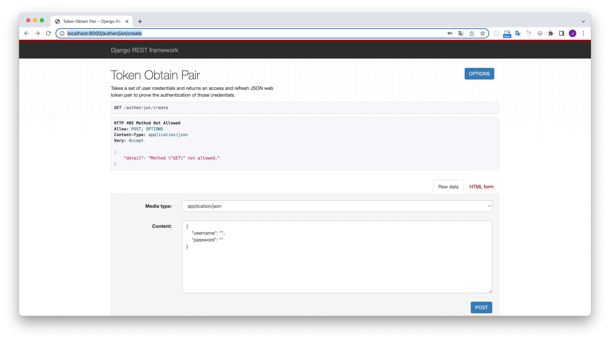
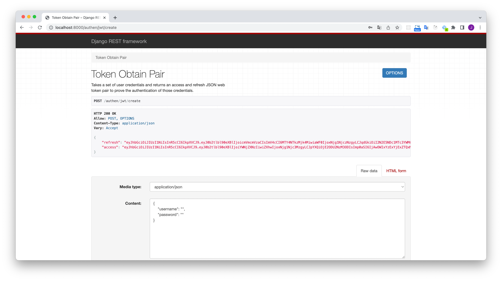
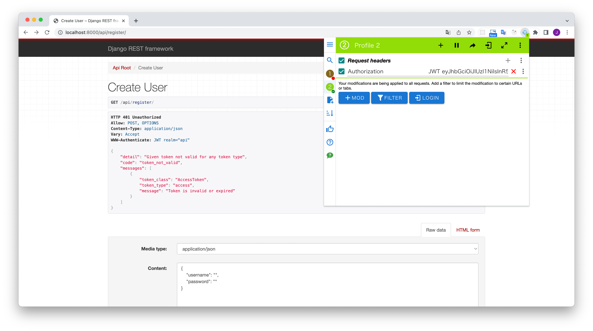
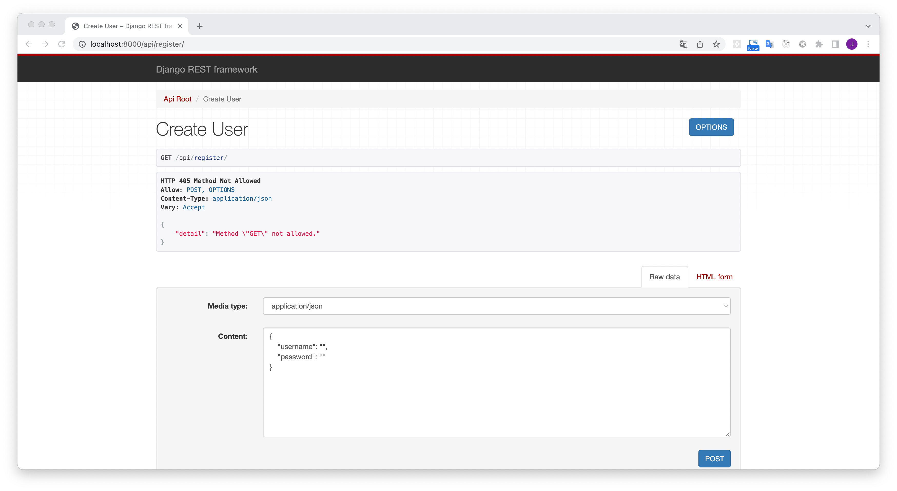
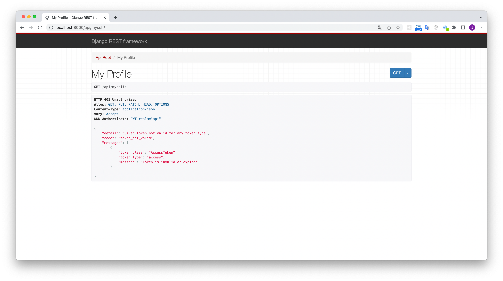
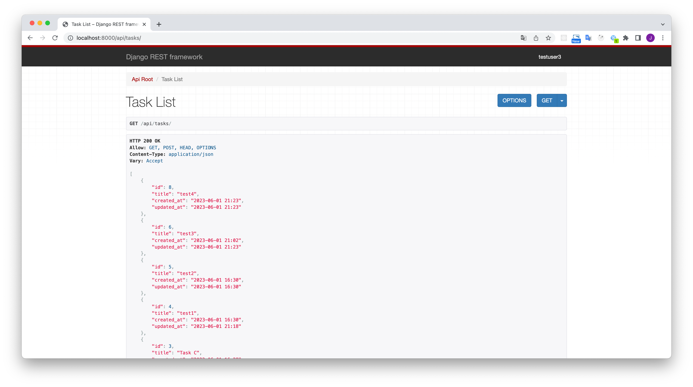
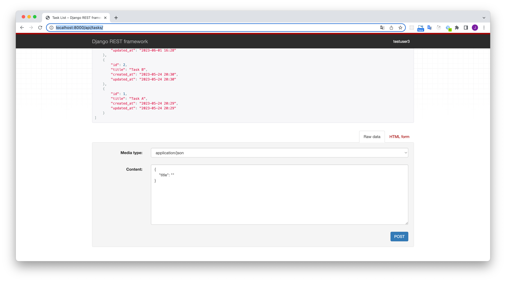
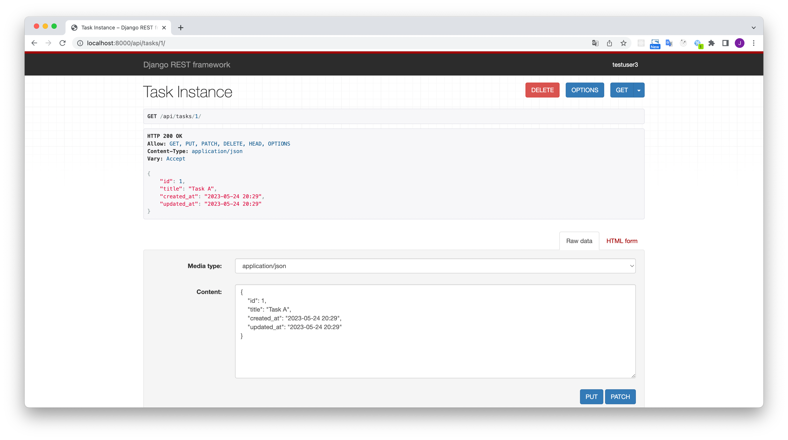

# [Redux編] Redux Tool KitとReact HooksによるモダンReact フロントエンド開発

https://www.udemy.com/share/103iJY3@s1lproZCQibfyj9RHvl2CECHzdvsXNkyS6BTchelhQJe_2K8QTRP1vZYGBxWsgYVvA==/

Kazu T+さんの講座でRTKでTodoアプリを作ります。
このリポジトリはDjango REST Frameworkで作成したバックエンド側です。

Django REST Frameworkについては[公式サイト](https://www.django-rest-framework.org/)を確認してください。

## Pythonの環境構築

私はpyenvとvirtualenvを組み合わせて使っていますが、各自使っているPythonの環境で結構です。

```sh
brew install pyenv
brew install pyenv-virtualenv
```

pyenvで最新バージョンのPythonをインストールします。
pyenv install -lでインストールできるPythonのリストが表示されます。
私は現時点の最新である3.11.3をインストールしました。

```sh
# インストールできるPythonのリストを確認
pyenv install -l

# pythonをインストールする。
pyenv install 3.11.3

# インストールしたPythonのバージョンを確認
pyenv versions

# virtualenvを生成
pyenv virtualenv 3.11.3 django_todoapi
```

プロジェクトのRootディレクトリーを生成して使いたいPythonを指定します。

```sh
mkdir django_todoapi
cd django_todoapi
pyenv local
```

これでこのプロジェクトに入ると自動でPython 3.11.3の仮装環境が用意されました。

## プロジェクトの生成及びスタート

```sh
cd django_todoapi
pip install -r requirements.txt
```

Databaseマイグレーションファイルを生成します。

```sh
python manage.py makemigrations
```

Databaseマイグレーションを行います。

```sh
python manage.py migrate
```

Database管理用のsuper userを生成します。

```sh
python manage.py createsuperuser
```

django RESTサーバーを立ち上げます。

```sh
python manage.py runserver
```

## サーバーの確認

Djangoの場合はadmin（管理ツール）をデフォルトで提供していて、マイグレーションを実行することでモデルファイルを元に自動でテーブルを生成します。そして、そのテーブルは管理ツールで操ることができます。

* 管理ツール

http://localhost:8000/admin

上記で生成したsuper userでログインします。


Addボタン押してデータを追加します。


DjangoだけではなくDjango REST Frameworkというライブラリーもインストールしないといけません。
pip install -r requirements.txtでライブラリーをインストールしたら、特に問題はありません。

APIの機能

* ログイン（post）

http://localhost:8000/authen/jwt/create/



usernameとpasswordを入力してpostボタンをクリックすると、JWTのaccess tokenの取得できる。



取得したJWTのaccess tokenを用いてログイン状態にするためにはhttp headerにその値を登録する必要があり、ModHeaderというchrome extentionを利用する。



* 会員登録（post）

http://localhost:8000/api/register/



* 会員情報（get）

http://localhost:8000/api/myself/



* Task一覧（get）

http://localhost:8000/api/tasks/



* Taskの登録（post）

http://localhost:8000/api/tasks/



* Taskの確認（get）
* Taskの更新（put）
* Taskの削除（delete）

http://localhost:8000/api/tasks/1


